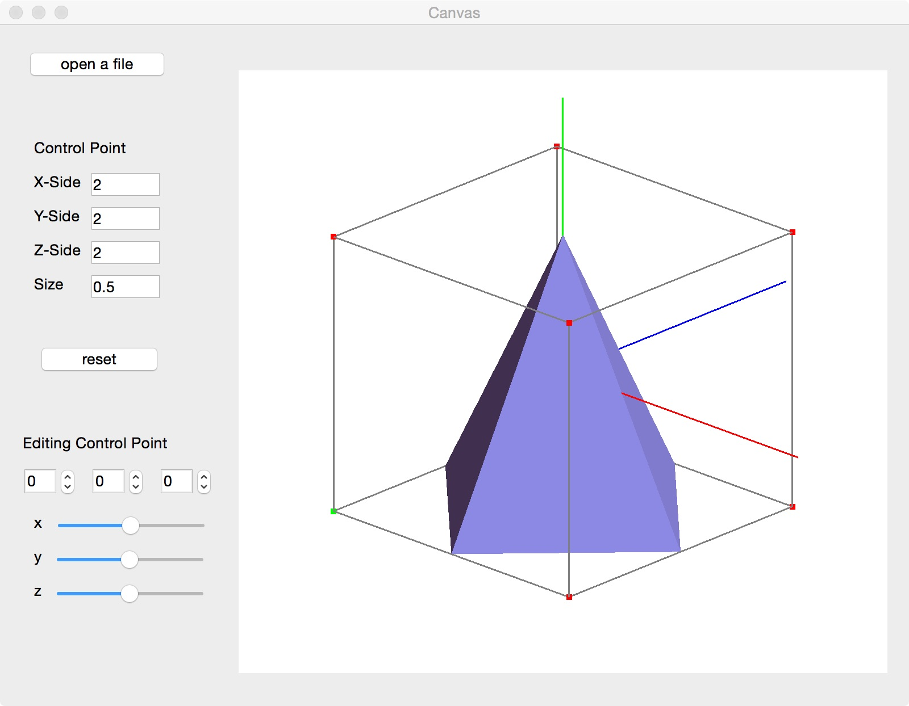
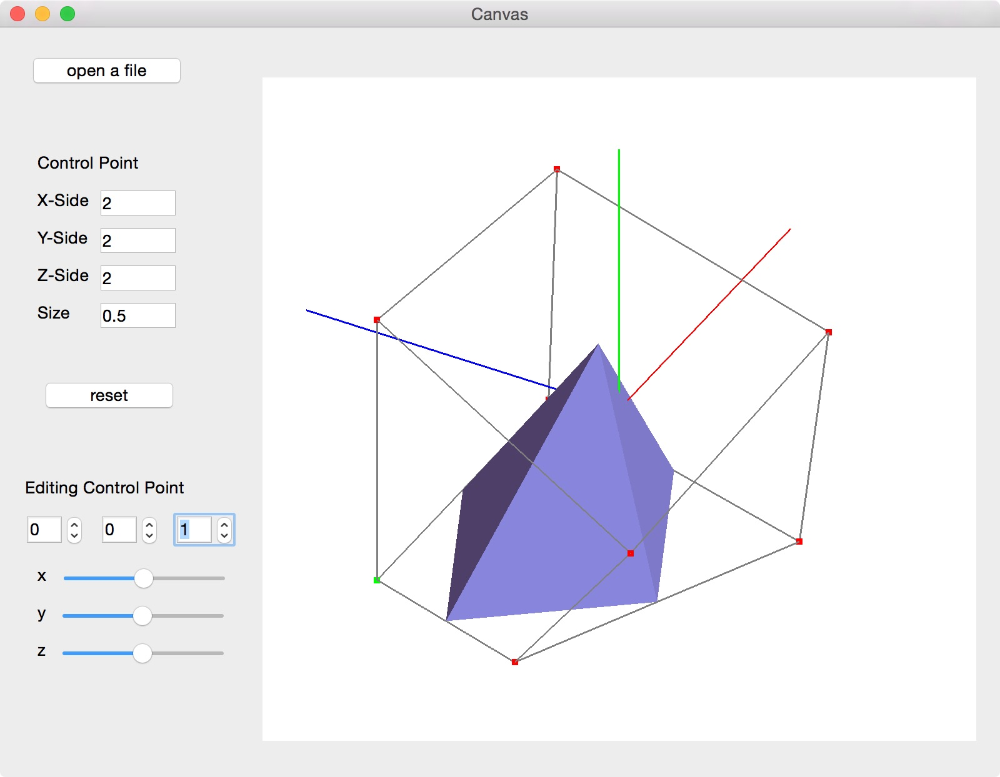
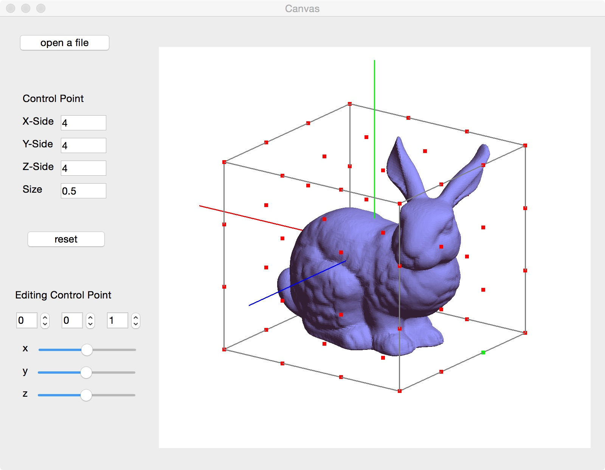
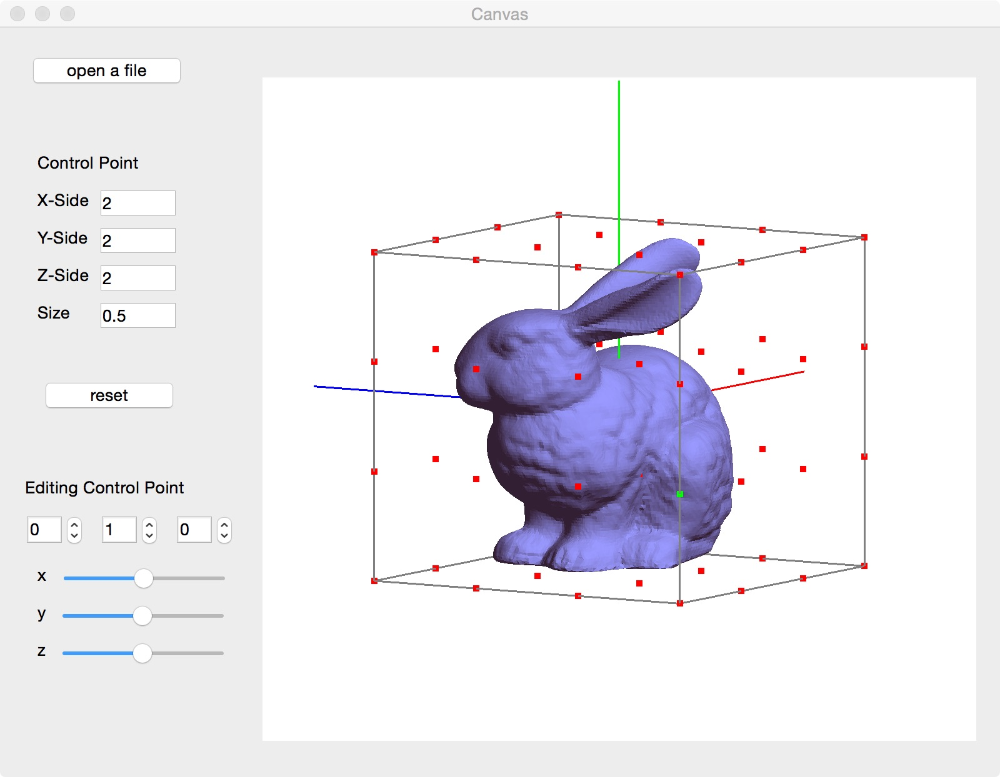
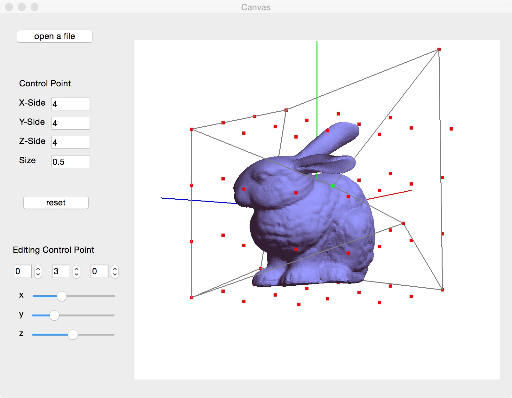

# Free Form Deformation Tool
This project provides a user-friendly implementation of the Free Form Deformation (FFD) algorithm using Qt, C++, and OpenGL. It allows users to interactively deform 3D meshes by manipulating control points, offering an intuitive interface for mesh editing and transformation.

## Usage

1. Download the project and unzip it.
2. Open the project in Visual Studio 2019.
3. Build the project.
4. Run the program.
5. press the "open a file" button then Select a obj file.
6. Use the mouse to drag the control points to deform the mesh.

## Showcase

## Configuration
qt 5.14.2_msvc2017_64
c++ 14
vs 2019
